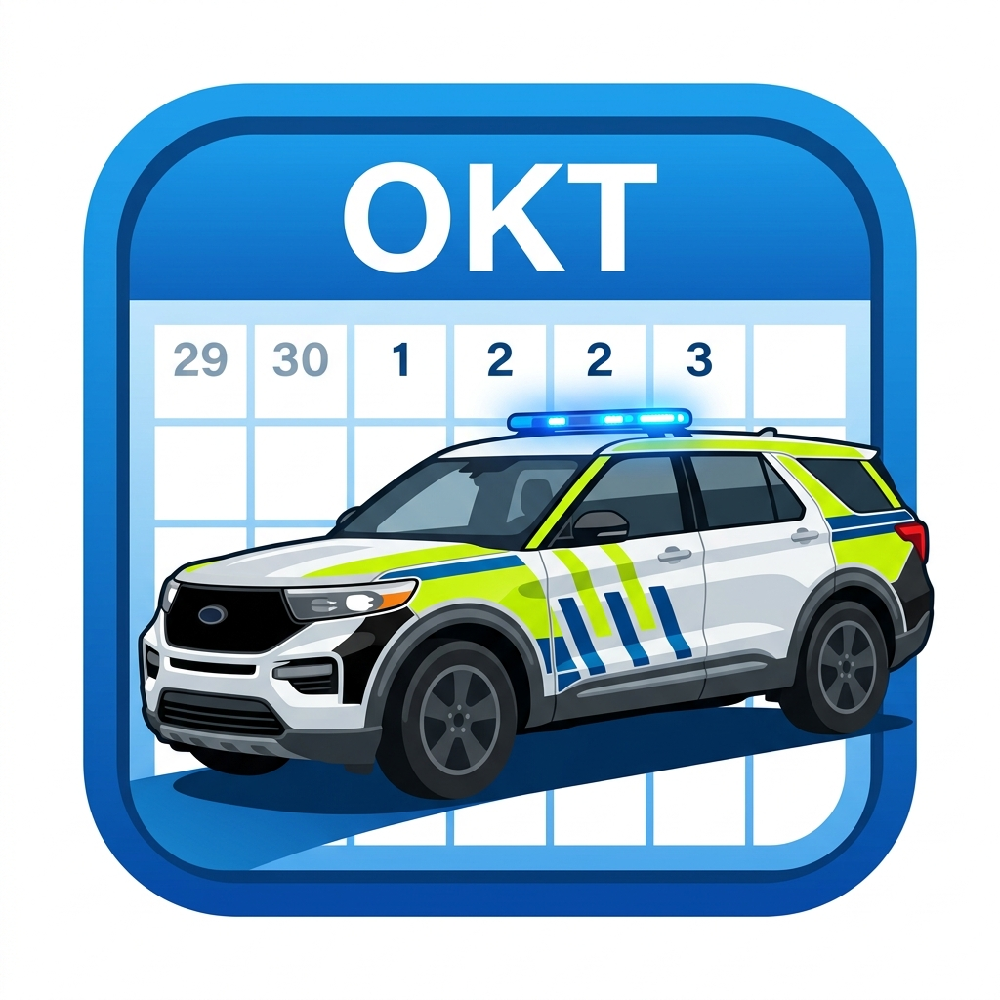

# 🛡️ Vakter i TTA til kalender

**Konverter vaktlister fra TTA til kalenderfiler (.ics) med automatisk regelsjekk og valgfri lønnsberegning.**

 

[🚀 **Prøv appen direkte i nettleseren**](https://olecreation.github.io/tta-ics)

---

## ✨ Nøkkelfunksjoner

- 📅 **Lynrask vaktkonvertering:** Lim inn uredigert tekst rett fra TTA og få ferdige `.ics`-hendelser for Google Kalender, Apple Kalender eller Outlook.
- ⚡ **100 % Privat & Lokalt:** Ingen data sendes over nett. All tolkning, beregning og lagring skjer utelukkende lokalt i din egen nettleser.
- ⚠️ **Automatisk Regelsjekk & Hviletid:** Varsler automatisk om brudd på hviletidsnormer (AML § 10-8 / særavtale for turnus) ved mindre enn 11 eller 8 timers hvile etter overtid.
- 💰 **Valgfri Lønnsberegning:** 
  - Standardmodus gir en ren og ryddig kalendereksport uten tallmas.
  - Ved ett klikk aktiveres full HTA-beregning for natt-, kvelds-, helge- og helligdagstillegg, samt faste månedlige tillegg (AT-tillegg/etterforsker).
- 💾 **Automatisk Lagring (`localStorage`):** Husker dine innstillinger (årslønn, divisor og tillegg) så du slipper å taste det inn på nytt.
- 🎨 **Moderne Design:** Støtter både mørk modus (Dark), lys modus (Light) og Toss Blue-tema, optimalisert for både mobil og PC.

---

## 🚀 Hvordan bruke verktøyet

1. **Kopier** vaktlisten din fra TTA (f.eks. ukevisning eller månedsvisning).
2. **Lim inn** i tekstfeltet på [olecreation.github.io/tta-ics](https://olecreation.github.io/tta-ics).
3. **Velg alternativer:**
   - Huk av for *«Vis timer i tittel»* hvis du vil ha f.eks. `08-15:30 | Vakt`.
   - Huk av for *«Beregn lønn»* hvis du ønsker estimert lønn og tillegg i kalenderen.
4. Trykk **«Konverter til kalender (ICS)»** for å laste ned `.ics`-filen eller importere direkte!

---

## 📱 Mobil-app installasjon (Android & iPhone)

Du kan enkelt bruke **Vakter i TTA til kalender** som en ekte app på mobilen:

### 🍎 iPhone / iPad (iOS)
1. Åpne **[olecreation.github.io/tta-ics](https://olecreation.github.io/tta-ics)** i **Safari**.
2. Trykk på **Del-knappen** (firkant med pil opp nederst på skjermen).
3. Rull ned og velg **«Legg til på Hjem-skjerm»** (*Add to Home Screen*).
4. Trykk **Legg til**. Appen legger seg nå som et eget ikon på hjemskjermen din med fullskjermvisning!

### 🤖 Android (Direkteinstallasjon / PWA)
1. Åpne **[olecreation.github.io/tta-ics](https://olecreation.github.io/tta-ics)** i **Google Chrome**.
2. Trykk på de tre prikkene **(⋮)** øverst til høyre.
3. Velg **«Installer app»** eller **«Legg til på startskjerm»**.
4. Appen installeres og fungerer akkurat som en vanlig app!

---

## 🛠️ Teknisk Arkitektur

- **Kjerneteknologi:** Ren Vanilla JavaScript (ES6+), HTML5 og CSS3.
- **Null eksterne avhengigheter:** Ingen tunge rammeverk eller sporingsskript.
- **Mobilkompatibel:** Bygget med støtte for [Capacitor](https://capacitorjs.com/) for native app-bygging (Android APK / iOS).
- **Helligdagsmotor:** Innebygd astronomisk påskeformel (Meeus/Jones/Butcher) for automatisk beregning av alle bevegelige norske helligdager (påske, Kristi himmelfart, pinse, 1. mai, 17. mai og julaften/nyttårsaften).

---

## 📄 Lisens & Opphavsrett

Dette prosjektet er lisensiert under **[Creative Commons Attribution-NonCommercial 4.0 International (CC BY-NC 4.0)](LICENSE)**.

- **Tillatt:** Fri bruk, modifikasjon og deling til personlige og ikke-kommersielle formål.
- **Forbudt:** All kommersiell bruk eller videresalg av bedrifter/selskaper uten eksplisitt skriftlig samtykke.

Copyright (c) 2026 **OMS023**.
